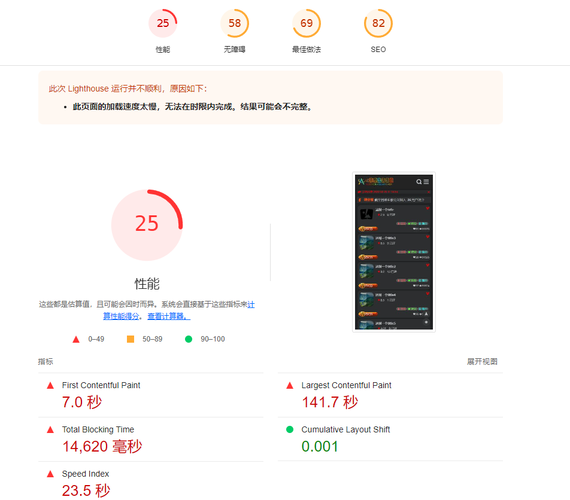
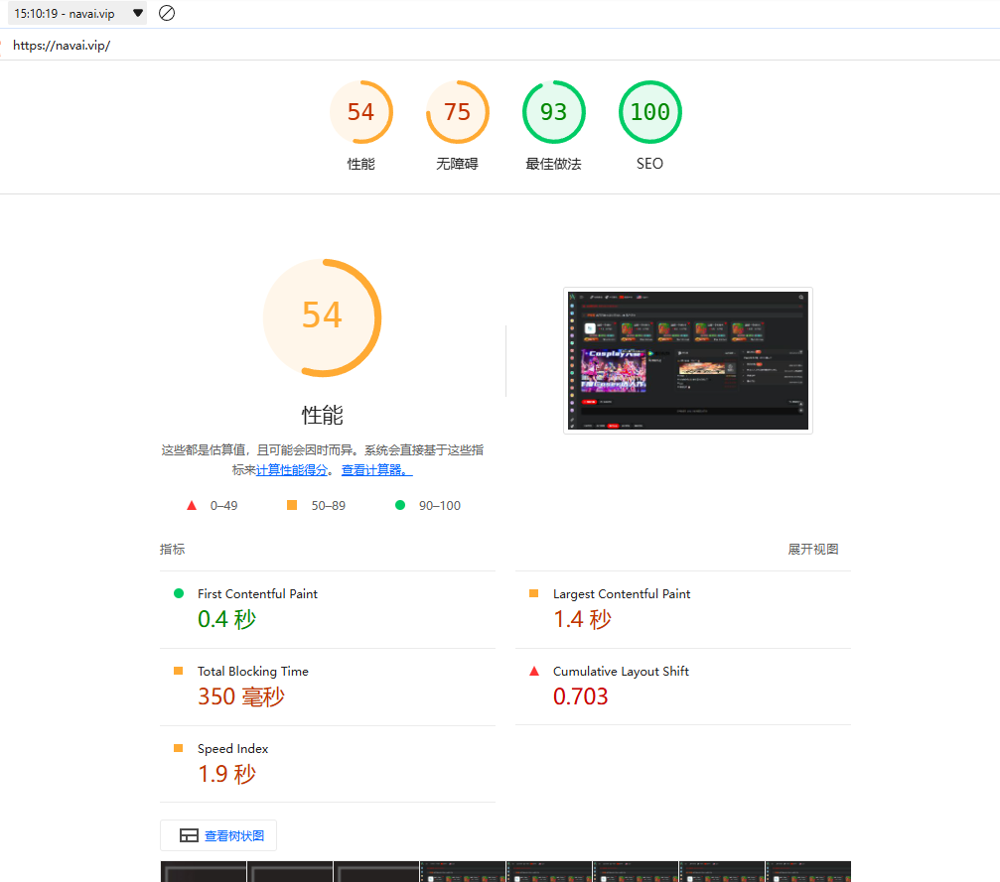
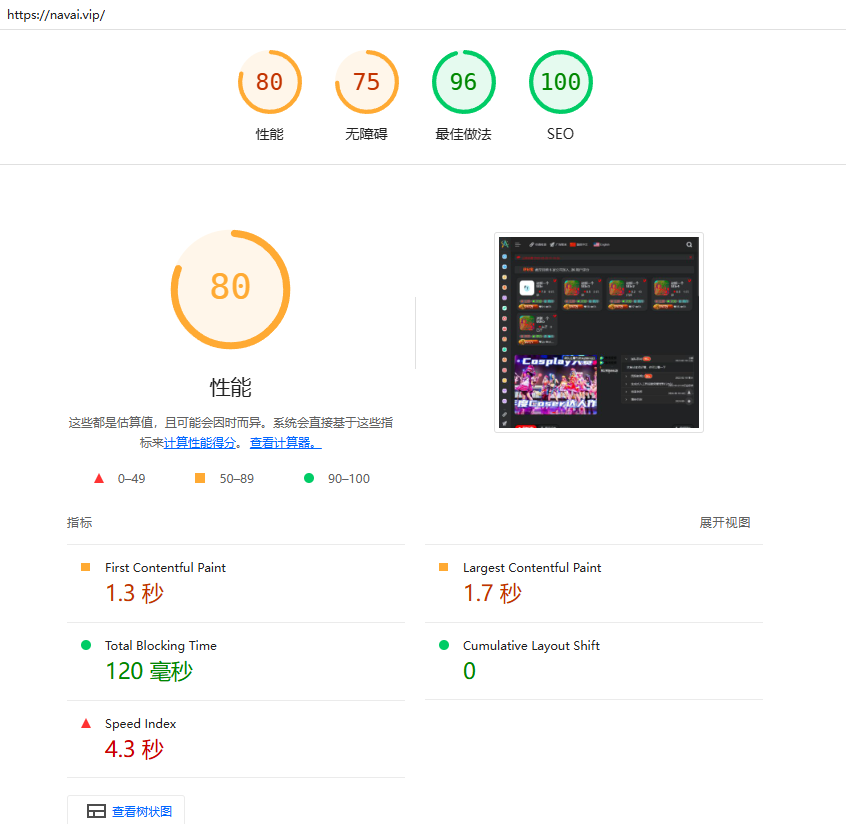

# 项目介绍
>这个是通过vue 转换为nuxt 的项目，项目可运行于本地环境，也可以部署到服务器上。线上使用的docker部署 dome [navai.vip](https://navai.vip)
### 项目环境
- 编程语言：nodejs + express + mongodb + nuxt + vue
- 运行环境：node.js:v16.13.2
- 依赖管理：npm:v8.1.2
- 前端框架：nuxt:v2.15.8
- 前端框架：vue:v2.7.10
- 数据库：mongodb:v4.4.12
- 服务器：CentOS 7.9
- 后台管理 :https://gitee.com/ugly8girl/navigationAdmin.git
### 项目运行
```
# 安装依赖
npm install

# 启动项目
npm run dev

# 打包项目
npm run build
```
### 项目部署
> 将打包的文件放入服务器指定目录，然后执行 `npm run start` 启动项目。
```
1.  .nuxt 文件夹
2.  static 文件夹
3.  package.json 文件
4.  nuxt.config.js 文件
5.  src 部分文件
6.  .env.development 文件
7.  .env.production 文件
 可以参照 www目录 进行配置
```
### 项目文件结构
```
├── layouts   // nuxt 最外层组件默认的是，这里可以添加loading 等组件
├── middleware  // 中间件 做路由拦截
├── static  // 页面组件 在src 目录下的static 是项目需要的文件没有打包的 console.log robots.txt sitemap.xml  favicon.ico 等静态文件
.... 
```
1. 渐变效果：在nuxt 这种有一个全局的渐变transition name为page，可以直接使用，不需要额外的配置
   1. 该项目配置到了 /assets/css/transition.scss 文件中，可以直接使用
2. 公共样式： 配置地址 可以为client.js 和 server.js 中的样式或者是nuxt.config.js 中的css属性
   1.client.js配置：`require('@/assets/css/reset.scss') ...` 客户端使用
   2.server.js配置：`require('~/assets/css/reset.scss') ...` 服务端使用
   3.nuxt.config.js配置：`css: ['@/assets/css/reset.scss', '@/assets/css/common.scss']` 全局使用，这里常用于初始化样式
   4.nuxt.config.js配置：`buildModules: ['@nuxtjs/style-resources']` 全局使用，常用变量 或者函数，动画等
   5.**_注意_** syleResources 配置的资源会导入每一个组件，这样会导致不是公共的样式也导入到每个组件中打包过大，所以需要配置白名单，只导入需要的组件，我就犯错这样的错误
   ```nuxt.config.js
    styleResources: {//配置变量全局使用 styleResources 配置的资源路径不能使用 ~ 和 @,要使用绝对或者相对路径
     scss: [
       './assets/css/_bianlian.scss',
[//]: # ('./assets/css/_handle.scss',)
       './assets/css/commonmMixin.scss',
       './assets/css/animation.scss'
     ],
    },
    ```

# 项目问题
### 当项目无法启动时，请检查以下问题：
1. **检测请求路径是否有访问值**  **_Request failed with status code 502_**
      1. 必须有数据否则项目无法启动，如：·Cannot GET /api/common/routerList·，该接口是 `src/static/sitempa.js` 的接口生成爬虫地图
      2. 如果getBaseList 接口没有数据，会直接跳转到 /error 页面
      3. 注意打包后 就不会生成新的sitemap.xml 文件，需要手动生成。
      4. 可以查看 `src/static/sitemap.js` 文件，就行修改接口地址
3. **图片问题**
> 图片本地图片地址是 src/assets/images, 数据库的图片地址为 static/images/~, lazy 图片为 static/lazy/~
   1. 图片使用 `VueLazyload` 懒加载组件 和 `@nuxtjs/image` 预加载组件
      1. 懒加载组件是在 client.js 中引入的，用于客户端的渲染使用
          1. 引入：`import VueLazyload from 'vue-lazyload'`
          2. 使用：``
          3. loading 和 error 图片是通过统一入口进行配置 `src/assets/js/handleLoadingImage.js` 
          4. 使用 data-[hotWeb1|gradeCoin1] 等熟悉进行区分加载 loading 图片和 error 图片
      2. 预加载组件是在 nuxt.config.js 中引入的，用于服务端渲染使用
        1. 引入是用过在 nuxt.config.js 中引入modules中引入 `'@nuxt/image'`，并配置好相关参数,如果使用`buildModules`引入则只会在开发者模式下生效
        2. 使用：`<nuxt-img preload  fit="cover" loading="lazy" format="webp"  :src="imgUrl(item.imgUrl,'article')" placeholder="/static/lazy/errorH1.png" />`
            1. 图片加载失败时，会使用 placeholder 属性配置的图片进行占位
            2. 图片加载成功时，会根据 fit 属性进行图片缩放
            3. 图片加载成功时，会根据 loading 属性进行图片懒加载
            4. 图片加载成功时，会根据 src 属性进行图片的真实地址
            5. preload 是nuxt-img 提供的预加载功能，可以提前加载图片，提高用户体验
            6. format 是nuxt-img 提供的图片格式转换功能，可以转换图片格式，减少图片体积
            7. api [nuxt2.x 图片组件](https://v0.image.nuxtjs.org/api/options) [nuxt3.x 图片组件](https://image.nuxtjs.org.cn/usage/nuxt-img)  
            8. 图片地址问题: 在 nuxt.config.js 的 image属性为 @nuxt/image 插件的配置项
               1. dir 为图片地址的前缀，会在使用nuxt-img组件时自动拼接
               2. domains 为图片服务器地址，运行加载的图片的地址的网站地址域名如：https://navai.vip/static/images/ 如果需要加载这个地址的图片就需要 将 navai.vip 添加到 domains 中，在开发环境中，
4. **项目优点**
   1. [x] 使用了 `@nuxtjs/sitemap` 实现sitemap 功能，可以生成网站地图，提高网站的SEO
   2. [x] 使用了 `nuxt-precompress` 实现gzip 和brotli 压缩功能，提高网站的访问速度
   3. [x] 使用了 `optimization.splitChunks` 优化打包体积，减少请求时间
   4. [x] 去掉` console.log` 等调试信息，提高网站的安全性
   5. [x] 使用 `@nuxt/i18n  + vue-i18n` 实现国际化
   6. [x] 使用 'sass less' 实现主题切换
   7. [x] 优化了代码结构，提高开发效率
        1. 将 qrcodejs2 修改为动态组件，可以根据需要引入，减少打包体积
        2. 将 'vue-social-share 修改为 动态组件，可以根据需要引入，减少打包体积
        3. 首屏 mains hotslider 等组件通过`new IntersectionObserver + import()`API 实现滚动导入家长在使用动态组件，可以根据需要引入，减少打包体积
   8. [x] 使用 `@nuxt/image` 配置 `provider: 'ipx', `和 ipx 路径`必须为完整地址，不能使用相对路径，不然会导致图片加载失败`，提高图片加载速度，将图片转换为 webp 格式，减少图片体积
   

# 项目结果 将打包文件从1M 到 700K，压缩率 90%，加载速度提升 20%
#### 1. 第一次优化


#### 1. 第二次优化


#### 2. 第三次优化


#### 文档
1. [nuxt2.x 非官方中文文档](https://www.w3cschool.cn/nuxtjs/nuxtjs-opyl36g3.html)
1. [优化方案](https://juejin.cn/post/7012567366198362120#heading-3)
